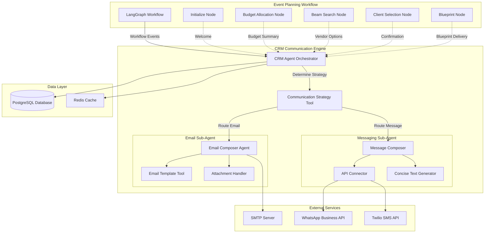
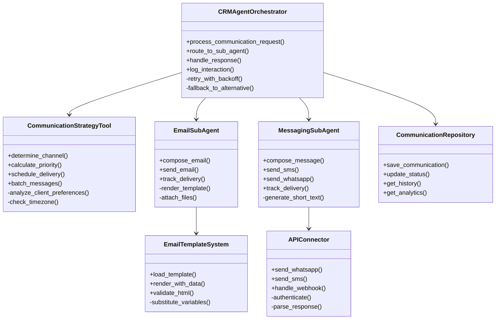

# Design Document - CRM Communication Engine Integration

## Overview

This document provides the comprehensive design for integrating a CRM Communication Engine into the Event Planning Agent v2 system. The CRM engine serves as the central communication hub, orchestrating multi-channel client interactions throughout the event planning lifecycle.

### Design Goals

1. **Seamless Integration**: Integrate with existing LangGraph workflow without disrupting current functionality
2. **Multi-Channel Support**: Enable email, SMS, and WhatsApp communications through a unified interface
3. **Intelligent Routing**: Automatically determine optimal communication channels based on context and preferences
4. **Scalability**: Handle high volumes of concurrent communications with minimal latency
5. **Reliability**: Implement robust error handling, retries, and fallback mechanisms
6. **Observability**: Provide comprehensive logging, monitoring, and analytics
7. **Security**: Ensure secure handling of client data and API credentials

### System Context

The CRM Communication Engine integrates with:
- **LangGraph Workflow**: Triggers communications at workflow transition points
- **PostgreSQL Database**: Persists communication logs and client preferences
- **External APIs**: WhatsApp Business API, Twilio SMS, SMTP servers
- **Streamlit GUI**: Displays communication history and preference management
- **Monitoring Stack**: Prometheus metrics and Grafana dashboards

## Architecture

### High-Level Architecture



### Component Architecture



## Components and Interfaces

### 1. CRM Agent Orchestrator

**Purpose**: Central coordinator for all CRM communications

**Responsibilities**:
- Receive communication requests from workflow nodes
- Determine optimal communication strategy
- Route requests to appropriate sub-agents
- Handle responses and update workflow state
- Implement retry logic and fallback mechanisms
- Log all interactions to database

**Interface**:
```python
class CRMAgentOrchestrator:
    def __init__(
        self,
        db_manager: DatabaseManager,
        strategy_tool: CommunicationStrategyTool,
        email_agent: EmailSubAgent,
        messaging_agent: MessagingSubAgent
    ):
        pass
    
    async def process_communication_request(
        self,
        plan_id: str,
        message_type: MessageType,
        context: Dict[str, Any],
        urgency: UrgencyLevel = UrgencyLevel.NORMAL
    ) -> CommunicationResult:
        """
        Process a communication request from the workflow.
        
        Args:
            plan_id: Event plan identifier
            message_type: Type of message (welcome, budget_summary, etc.)
            context: Message context data
            urgency: Message urgency level
            
        Returns:
            CommunicationResult with status and metadata
        """
        pass

    
    async def route_to_sub_agent(
        self,
        strategy: CommunicationStrategy,
        context: Dict[str, Any]
    ) -> CommunicationResult:
        """Route communication to appropriate sub-agent"""
        pass
    
    async def handle_client_response(
        self,
        plan_id: str,
        response_data: Dict[str, Any]
    ) -> None:
        """Handle incoming client response"""
        pass
```

**Key Methods**:
- `process_communication_request()`: Main entry point for workflow communications
- `route_to_sub_agent()`: Routes to email or messaging sub-agent
- `handle_client_response()`: Processes client responses (selections, confirmations)
- `retry_with_backoff()`: Implements exponential backoff retry logic
- `fallback_to_alternative()`: Falls back to alternative channels on failure

### 2. Communication Strategy Tool

**Purpose**: Intelligent decision-making for communication routing and scheduling

**Responsibilities**:
- Analyze message type, urgency, and client preferences
- Determine optimal communication channel(s)
- Calculate delivery priority and timing
- Batch non-urgent messages to avoid overwhelming clients
- Respect client timezone and quiet hours

**Interface**:
```python
class CommunicationStrategyTool:
    def determine_strategy(
        self,
        message_type: MessageType,
        urgency: UrgencyLevel,
        client_preferences: ClientPreferences,
        current_time: datetime
    ) -> CommunicationStrategy:
        """
        Determine optimal communication strategy.
        
        Args:
            message_type: Type of message to send
            urgency: Message urgency level
            client_preferences: Client communication preferences
            current_time: Current timestamp
            
        Returns:
            CommunicationStrategy with channel, timing, and priority
        """
        pass
    
    def should_batch(
        self,
        pending_messages: List[PendingMessage],
        new_message: PendingMessage
    ) -> bool:
        """Determine if messages should be batched"""
        pass
    
    def calculate_optimal_send_time(
        self,
        client_timezone: str,
        urgency: UrgencyLevel
    ) -> datetime:
        """Calculate optimal send time based on timezone and urgency"""
        pass
```

**Decision Logic**:


1. **Channel Selection Priority**:
   - CRITICAL urgency + WhatsApp preferred → WhatsApp
   - CRITICAL urgency + no WhatsApp → SMS
   - Detailed information (budget, vendors) → Email
   - Quick confirmation needed → SMS or WhatsApp
   - Client opted out of channel → Skip to next priority

2. **Timing Rules**:
   - CRITICAL: Send immediately
   - HIGH: Send within 1 hour
   - NORMAL: Send during business hours (9 AM - 6 PM local time)
   - LOW: Batch with other messages, send once daily

3. **Batching Rules**:
   - Batch LOW priority messages
   - Don't batch if last message was > 24 hours ago
   - Don't batch CRITICAL or HIGH priority messages
   - Maximum batch size: 3 messages

### 3. Email Sub-Agent

**Purpose**: Handle all email communications with professional formatting

**Responsibilities**:
- Compose emails using templates
- Render HTML with dynamic content
- Attach files (PDFs, images)
- Send via SMTP
- Track delivery, opens, and clicks

**Interface**:
```python
class EmailSubAgent:
    def __init__(
        self,
        template_system: EmailTemplateSystem,
        smtp_config: SMTPConfig,
        attachment_handler: AttachmentHandler
    ):
        pass
    
    async def compose_and_send(
        self,
        recipient: str,
        message_type: MessageType,
        context: Dict[str, Any],
        attachments: Optional[List[Attachment]] = None
    ) -> EmailResult:
        """
        Compose and send an email.
        
        Args:
            recipient: Recipient email address
            message_type: Type of email template to use
            context: Template context data
            attachments: Optional file attachments
            
        Returns:
            EmailResult with delivery status
        """
        pass
    
    async def track_engagement(
        self,
        email_id: str,
        event_type: EngagementEvent
    ) -> None:
        """Track email engagement (opens, clicks)"""
        pass
```

**Email Templates**:


1. **welcome.html**: Welcome email with plan overview
2. **budget_summary.html**: Budget allocation strategies with visual charts
3. **vendor_options.html**: Vendor combinations with cards and CTAs
4. **selection_confirmation.html**: Confirmation of selected vendors
5. **blueprint_delivery.html**: Final blueprint with PDF attachment
6. **error_notification.html**: Error notification with support info
7. **reminder.html**: Gentle reminder for pending actions

**Template Variables**:
- `{{client_name}}`: Client's name
- `{{event_type}}`: Type of event
- `{{event_date}}`: Event date
- `{{plan_id}}`: Plan identifier
- `{{budget_allocations}}`: List of budget strategies
- `{{vendor_combinations}}`: List of vendor options
- `{{selected_vendors}}`: Selected vendor details
- `{{blueprint_url}}`: Link to download blueprint
- `{{support_email}}`: Support contact email

### 4. Messaging Sub-Agent

**Purpose**: Handle SMS and WhatsApp communications

**Responsibilities**:
- Compose concise messages (< 160 chars for SMS)
- Send via WhatsApp Business API
- Send via Twilio SMS API
- Handle delivery receipts
- Process incoming responses

**Interface**:
```python
class MessagingSubAgent:
    def __init__(
        self,
        api_connector: APIConnector,
        text_generator: ConciseTextGenerator
    ):
        pass
    
    async def send_whatsapp(
        self,
        phone_number: str,
        message_type: MessageType,
        context: Dict[str, Any]
    ) -> MessageResult:
        """Send WhatsApp message"""
        pass
    
    async def send_sms(
        self,
        phone_number: str,
        message_type: MessageType,
        context: Dict[str, Any]
    ) -> MessageResult:
        """Send SMS message"""
        pass
    
    async def handle_incoming_message(
        self,
        phone_number: str,
        message_body: str,
        channel: MessageChannel
    ) -> None:
        """Process incoming message from client"""
        pass
```

**Message Templates**:


1. **welcome_sms**: "Welcome to Planiva! Your event plan #{plan_id} is being created. We'll notify you when ready."
2. **budget_ready_sms**: "Your budget strategies are ready! View options: {link}"
3. **vendors_ready_whatsapp**: "🎉 We found {count} vendor combinations for your {event_type}! Check them out: {link}"
4. **selection_needed_sms**: "Please select your preferred vendor combination: {link}"
5. **blueprint_ready_whatsapp**: "✅ Your event blueprint is ready! Download: {link}"
6. **reminder_sms**: "Reminder: Please review your vendor options for plan #{plan_id}: {link}"

### 5. Email Template System

**Purpose**: Manage and render email templates with dynamic content

**Responsibilities**:
- Load HTML templates from filesystem
- Substitute variables with context data
- Validate HTML structure
- Support responsive design
- Handle template versioning

**Interface**:
```python
class EmailTemplateSystem:
    def __init__(self, templates_dir: Path):
        self.templates_dir = templates_dir
        self.template_cache: Dict[str, Template] = {}
    
    def load_template(
        self,
        template_name: str
    ) -> Template:
        """Load template from filesystem with caching"""
        pass
    
    def render(
        self,
        template_name: str,
        context: Dict[str, Any]
    ) -> str:
        """Render template with context data"""
        pass
    
    def validate_html(self, html: str) -> bool:
        """Validate HTML structure"""
        pass
```

**Template Structure**:
```html
<!DOCTYPE html>
<html>
<head>
    <meta charset="UTF-8">
    <meta name="viewport" content="width=device-width, initial-scale=1.0">
    <title>{{email_subject}}</title>
    <style>
        /* Responsive CSS */
        body { font-family: Arial, sans-serif; }
        .container { max-width: 600px; margin: 0 auto; }
        .button { background-color: #4CAF50; color: white; padding: 10px 20px; }
        @media only screen and (max-width: 600px) {
            .container { width: 100% !important; }
        }
    </style>
</head>
<body>
    <div class="container">
        <h1>Hello {{client_name}}!</h1>
        <!-- Template-specific content -->
        {{content_block}}
    </div>
</body>
</html>
```

### 6. API Connector

**Purpose**: Interface with external messaging APIs

**Responsibilities**:
- Authenticate with WhatsApp Business API and Twilio
- Send messages via APIs
- Handle webhooks for delivery receipts
- Parse API responses
- Implement rate limiting

**Interface**:
```python
class APIConnector:

    def __init__(
        self,
        whatsapp_config: WhatsAppConfig,
        twilio_config: TwilioConfig
    ):
        pass
    
    async def send_whatsapp_message(
        self,
        phone_number: str,
        message: str,
        media_url: Optional[str] = None
    ) -> APIResponse:
        """Send WhatsApp message via Business API"""
        pass
    
    async def send_sms_message(
        self,
        phone_number: str,
        message: str
    ) -> APIResponse:
        """Send SMS via Twilio"""
        pass
    
    async def handle_webhook(
        self,
        webhook_data: Dict[str, Any]
    ) -> WebhookResult:
        """Process webhook from messaging APIs"""
        pass
```

**API Configuration**:
```python
@dataclass
class WhatsAppConfig:
    api_url: str = "https://graph.facebook.com/v18.0"
    phone_number_id: str
    access_token: str
    webhook_verify_token: str

@dataclass
class TwilioConfig:
    account_sid: str
    auth_token: str
    from_number: str
    webhook_url: str
```

## Data Models

### Communication Models

```python
from enum import Enum
from dataclasses import dataclass
from datetime import datetime
from typing import Optional, Dict, Any, List

class MessageType(str, Enum):
    WELCOME = "welcome"
    BUDGET_SUMMARY = "budget_summary"
    VENDOR_OPTIONS = "vendor_options"
    SELECTION_CONFIRMATION = "selection_confirmation"
    BLUEPRINT_DELIVERY = "blueprint_delivery"
    ERROR_NOTIFICATION = "error_notification"
    REMINDER = "reminder"

class MessageChannel(str, Enum):
    EMAIL = "email"
    SMS = "sms"
    WHATSAPP = "whatsapp"

class UrgencyLevel(str, Enum):
    CRITICAL = "critical"  # Send immediately
    HIGH = "high"          # Send within 1 hour
    NORMAL = "normal"      # Send during business hours
    LOW = "low"            # Batch and send daily

class CommunicationStatus(str, Enum):
    PENDING = "pending"
    QUEUED = "queued"
    SENT = "sent"
    DELIVERED = "delivered"
    OPENED = "opened"
    CLICKED = "clicked"
    FAILED = "failed"
    BOUNCED = "bounced"

@dataclass
class CommunicationRequest:
    plan_id: str
    client_id: str
    message_type: MessageType
    context: Dict[str, Any]
    urgency: UrgencyLevel = UrgencyLevel.NORMAL
    preferred_channel: Optional[MessageChannel] = None

@dataclass
class CommunicationStrategy:
    primary_channel: MessageChannel
    fallback_channels: List[MessageChannel]
    send_time: datetime
    priority: int
    batch_with: Optional[List[str]] = None

@dataclass
class CommunicationResult:
    communication_id: str
    status: CommunicationStatus
    channel_used: MessageChannel
    sent_at: Optional[datetime]
    delivered_at: Optional[datetime]
    error_message: Optional[str] = None
    metadata: Dict[str, Any] = None

@dataclass
class ClientPreferences:
    client_id: str
    preferred_channels: List[MessageChannel]
    timezone: str
    quiet_hours_start: str  # "22:00"
    quiet_hours_end: str    # "08:00"
    opt_out_email: bool = False
    opt_out_sms: bool = False
    opt_out_whatsapp: bool = False
```

### Database Schema

```sql
-- CRM Communications Table
CREATE TABLE IF NOT EXISTS crm_communications (
    communication_id UUID PRIMARY KEY DEFAULT gen_random_uuid(),
    plan_id UUID NOT NULL REFERENCES event_plans(plan_id),
    client_id UUID NOT NULL,
    message_type VARCHAR(50) NOT NULL,
    channel VARCHAR(20) NOT NULL,
    status VARCHAR(20) NOT NULL DEFAULT 'pending',
    subject TEXT,
    content TEXT,
    context JSONB,
    urgency VARCHAR(20) DEFAULT 'normal',
    created_at TIMESTAMP WITH TIME ZONE DEFAULT NOW(),
    sent_at TIMESTAMP WITH TIME ZONE,
    delivered_at TIMESTAMP WITH TIME ZONE,
    opened_at TIMESTAMP WITH TIME ZONE,
    clicked_at TIMESTAMP WITH TIME ZONE,
    failed_at TIMESTAMP WITH TIME ZONE,
    error_message TEXT,
    retry_count INTEGER DEFAULT 0,
    metadata JSONB,
    INDEX idx_plan_id (plan_id),
    INDEX idx_client_id (client_id),
    INDEX idx_status (status),
    INDEX idx_created_at (created_at)
);

-- CRM Client Preferences Table
CREATE TABLE IF NOT EXISTS crm_client_preferences (
    client_id UUID PRIMARY KEY,
    preferred_channels JSONB DEFAULT '["email"]',
    timezone VARCHAR(50) DEFAULT 'UTC',
    quiet_hours_start TIME DEFAULT '22:00:00',
    quiet_hours_end TIME DEFAULT '08:00:00',
    opt_out_email BOOLEAN DEFAULT FALSE,
    opt_out_sms BOOLEAN DEFAULT FALSE,
    opt_out_whatsapp BOOLEAN DEFAULT FALSE,
    created_at TIMESTAMP WITH TIME ZONE DEFAULT NOW(),
    updated_at TIMESTAMP WITH TIME ZONE DEFAULT NOW()
);

-- CRM Communication Templates Table
CREATE TABLE IF NOT EXISTS crm_communication_templates (
    template_id UUID PRIMARY KEY DEFAULT gen_random_uuid(),
    template_name VARCHAR(100) UNIQUE NOT NULL,
    channel VARCHAR(20) NOT NULL,
    subject_template TEXT,
    content_template TEXT NOT NULL,
    variables JSONB,
    version INTEGER DEFAULT 1,
    is_active BOOLEAN DEFAULT TRUE,
    created_at TIMESTAMP WITH TIME ZONE DEFAULT NOW(),
    updated_at TIMESTAMP WITH TIME ZONE DEFAULT NOW(),
    INDEX idx_template_name (template_name),
    INDEX idx_channel (channel)
);

-- CRM Delivery Logs Table
CREATE TABLE IF NOT EXISTS crm_delivery_logs (
    log_id UUID PRIMARY KEY DEFAULT gen_random_uuid(),
    communication_id UUID NOT NULL REFERENCES crm_communications(communication_id) ON DELETE CASCADE,
    event_type VARCHAR(50) NOT NULL,
    event_timestamp TIMESTAMP WITH TIME ZONE DEFAULT NOW(),
    delivery_status VARCHAR(50),
    provider_response JSONB,
    error_details TEXT,
    INDEX idx_communication_id (communication_id),
    INDEX idx_event_type (event_type),
    INDEX idx_event_timestamp (event_timestamp)
);

-- CRM Analytics View
CREATE OR REPLACE VIEW crm_communication_analytics AS
SELECT 
    message_type,
    channel,
    DATE(created_at) as date,
    COUNT(*) as total_sent,
    SUM(CASE WHEN status = 'delivered' THEN 1 ELSE 0 END) as delivered_count,
    SUM(CASE WHEN opened_at IS NOT NULL THEN 1 ELSE 0 END) as opened_count,
    SUM(CASE WHEN clicked_at IS NOT NULL THEN 1 ELSE 0 END) as clicked_count,
    SUM(CASE WHEN status = 'failed' THEN 1 ELSE 0 END) as failed_count,
    AVG(EXTRACT(EPOCH FROM (delivered_at - sent_at))) as avg_delivery_time_seconds
FROM crm_communications
GROUP BY message_type, channel, DATE(created_at);
```

**Design Rationale**: 
- **JSONB columns** for flexible metadata storage without schema changes
- **Comprehensive indexes** on frequently queried columns for performance
- **Timestamp tracking** at each stage (sent, delivered, opened, clicked) for analytics
- **Retry counter** to prevent infinite retry loops
- **Cascading deletes** on delivery logs to maintain referential integrity
- **Analytics view** for efficient reporting without complex queries

## Error 
Handling

### Retry Strategy

**Design Decision**: Implement exponential backoff with jitter to prevent thundering herd problems.

**Retry Configuration**:
```python
@dataclass
class RetryConfig:
    max_retries: int = 3
    initial_delay: int = 60  # seconds
    max_delay: int = 900  # 15 minutes
    exponential_base: int = 5
    jitter: bool = True
```

**Retry Logic**:
1. **First retry**: Wait 1 minute
2. **Second retry**: Wait 5 minutes
3. **Third retry**: Wait 15 minutes
4. **After max retries**: Mark as failed and notify administrators

**Rationale**: Exponential backoff gives temporary issues time to resolve while preventing resource exhaustion. Jitter prevents synchronized retries across multiple communications.

### Fallback Mechanisms

**Channel Fallback Priority**:
1. Primary channel fails → Try first fallback channel
2. First fallback fails → Try second fallback channel
3. All channels fail → Log critical error and queue for manual review

**Example Fallback Chain**:
- WhatsApp (primary) → SMS (fallback 1) → Email (fallback 2)
- Email (primary) → SMS (fallback 1)
- SMS (primary) → Email (fallback 1)

**Rationale**: Multi-channel fallback ensures critical communications reach clients even when preferred channels are unavailable.

### Error Categories

```python
class ErrorCategory(str, Enum):
    TRANSIENT = "transient"  # Retry automatically
    PERMANENT = "permanent"  # Don't retry, log and alert
    RATE_LIMIT = "rate_limit"  # Retry with longer delay
    AUTH_FAILURE = "auth_failure"  # Alert immediately
    INVALID_INPUT = "invalid_input"  # Don't retry, log validation error
```

**Error Handling by Category**:
- **TRANSIENT**: Network timeouts, temporary API unavailability → Retry with backoff
- **PERMANENT**: Invalid phone number, bounced email → Mark failed, don't retry
- **RATE_LIMIT**: API quota exceeded → Queue and retry after rate limit window
- **AUTH_FAILURE**: Invalid credentials → Alert administrators immediately
- **INVALID_INPUT**: Malformed data → Log validation error, don't retry

## Testing Strategy

### Unit Testing

**Components to Test**:
1. **CommunicationStrategyTool**: Channel selection logic, timing calculations, batching rules
2. **EmailTemplateSystem**: Template rendering, variable substitution, HTML validation
3. **APIConnector**: Request formatting, response parsing, error handling
4. **CRMAgentOrchestrator**: Routing logic, retry mechanisms, state management

**Test Coverage Goals**: 90% code coverage for core logic

### Integration Testing

**Test Scenarios**:
1. **End-to-end workflow**: Trigger communication from workflow node → Verify delivery
2. **Multi-channel fallback**: Simulate primary channel failure → Verify fallback
3. **Database persistence**: Send communication → Verify database records
4. **Webhook handling**: Simulate delivery receipt → Verify status update
5. **Client response processing**: Simulate client reply → Verify workflow update

### Mock External Services

**Rationale**: Use mocks for external APIs during testing to avoid costs and ensure deterministic results.

**Mock Implementations**:
- **MockSMTPServer**: Simulates email sending without actual delivery
- **MockWhatsAppAPI**: Returns success responses without calling real API
- **MockTwilioAPI**: Simulates SMS delivery and webhooks

## Security Considerations

### Data Encryption

**At Rest**:
- Encrypt sensitive fields (email, phone_number) using PostgreSQL pgcrypto extension
- Store encryption keys in environment variables, never in code
- Use AES-256 encryption for maximum security

**In Transit**:
- All API calls use HTTPS/TLS 1.2 or higher
- Validate SSL certificates for all external connections
- Use secure WebSocket connections for real-time updates

**Design Rationale**: Defense in depth approach ensures data protection even if one layer is compromised.

### API Credential Management

**Storage**:
```python
# Environment variables (never commit to version control)
WHATSAPP_ACCESS_TOKEN=<token>
TWILIO_AUTH_TOKEN=<token>
SMTP_PASSWORD=<password>
DB_ENCRYPTION_KEY=<key>
```

**Access Control**:
- Credentials loaded at startup from environment
- Never logged or exposed in error messages
- Rotated regularly (quarterly minimum)

**Rationale**: Environment-based configuration prevents credential leakage through version control and enables different credentials per environment.

### Compliance

**CAN-SPAM Act Compliance**:
- Include unsubscribe link in all marketing emails
- Honor opt-out requests within 10 business days
- Include physical mailing address in email footer
- Use accurate "From" names and subject lines

**GDPR Compliance**:
- Obtain explicit consent before sending communications
- Provide data export functionality
- Implement right to be forgotten (data deletion)
- Log all data access for audit trails

**Data Retention**:
- Communication logs: Retain for 2 years
- Client preferences: Retain while account is active
- Deleted client data: Purge within 30 days

**Rationale**: Proactive compliance reduces legal risk and builds client trust.

## Workflow Integration Points

### LangGraph Node Hooks

**Integration Pattern**: Use LangGraph's state update mechanism to trigger CRM communications.

```python
# In workflow node
async def budget_allocation_node(state: WorkflowState) -> WorkflowState:
    # Perform budget allocation logic
    budget_strategies = calculate_budget_strategies(state)
    
    # Trigger CRM communication
    crm_result = await crm_orchestrator.process_communication_request(
        plan_id=state.plan_id,
        message_type=MessageType.BUDGET_SUMMARY,
        context={
            "client_name": state.client_name,
            "budget_strategies": budget_strategies,
            "event_type": state.event_type
        },
        urgency=UrgencyLevel.NORMAL
    )
    
    # Update state with communication result
    state.communications.append(crm_result)
    return state
```

**Workflow Trigger Points**:

1. **initialize_planning** → Welcome communication
   - Urgency: NORMAL
   - Channel: Email (primary)
   - Content: Plan overview, next steps, timeline

2. **budget_allocation_node** → Budget summary communication
   - Urgency: NORMAL
   - Channel: Email (primary)
   - Content: Three budget strategies with visualizations

3. **beam_search_node** (present_options) → Vendor options communication
   - Urgency: HIGH
   - Channel: Email (primary), WhatsApp (secondary)
   - Content: Vendor combinations with selection links

4. **client_selection** → Selection confirmation communication
   - Urgency: NORMAL
   - Channel: Email (primary), SMS (secondary)
   - Content: Confirmation of selected vendors, next steps

5. **blueprint_generation** → Blueprint delivery communication
   - Urgency: HIGH
   - Channel: Email with PDF attachment (primary), WhatsApp with link (secondary)
   - Content: Final blueprint, implementation guidance

6. **error_handler** → Error notification communication
   - Urgency: CRITICAL
   - Channel: SMS (primary), Email (secondary)
   - Content: Apology, explanation, support contact

**Design Rationale**: Tight integration with workflow nodes ensures communications are triggered automatically at the right moments without manual intervention.

### State Management

**Communication State in Workflow**:
```python
@dataclass
class WorkflowState:
    plan_id: str
    client_id: str
    # ... other workflow fields
    communications: List[CommunicationResult] = field(default_factory=list)
    last_communication_at: Optional[datetime] = None
    pending_client_action: Optional[str] = None
```

**Rationale**: Storing communication history in workflow state enables conditional logic based on client engagement.

## Performance Optimization

### Caching Strategy

**Redis Cache Usage**:
1. **Client preferences**: Cache for 1 hour to reduce database queries
2. **Email templates**: Cache indefinitely, invalidate on template updates
3. **API rate limit counters**: Track API usage to prevent quota exhaustion

**Cache Keys**:
```python
CACHE_KEYS = {
    "client_prefs": "crm:prefs:{client_id}",
    "email_template": "crm:template:email:{template_name}",
    "sms_template": "crm:template:sms:{template_name}",
    "rate_limit": "crm:ratelimit:{api}:{window}"
}
```

**Rationale**: Caching reduces database load and improves response times for frequently accessed data.

### Asynchronous Processing

**Design Decision**: Use async/await for all I/O operations to maximize throughput.

**Async Operations**:
- Database queries (asyncpg)
- HTTP API calls (aiohttp)
- Email sending (aiosmtplib)
- Redis operations (aioredis)

**Rationale**: Asynchronous processing allows handling multiple communications concurrently without blocking, significantly improving system throughput.

### Batch Processing

**Batch Configuration**:
```python
@dataclass
class BatchConfig:
    max_batch_size: int = 3
    batch_window_seconds: int = 300  # 5 minutes
    eligible_urgency_levels: List[UrgencyLevel] = field(
        default_factory=lambda: [UrgencyLevel.LOW]
    )
```

**Batching Logic**:
1. Queue LOW urgency messages for batching
2. Wait up to 5 minutes for additional messages
3. Send batch when max size reached or window expires
4. Combine multiple messages into single communication

**Rationale**: Batching reduces API costs and prevents overwhelming clients with too many messages.

## Monitoring and Observability

### Metrics

**Prometheus Metrics**:
```python
# Communication metrics
crm_communications_total = Counter(
    'crm_communications_total',
    'Total communications sent',
    ['message_type', 'channel', 'status']
)

crm_delivery_time_seconds = Histogram(
    'crm_delivery_time_seconds',
    'Time from send to delivery',
    ['channel']
)

crm_open_rate = Gauge(
    'crm_open_rate',
    'Email open rate',
    ['message_type']
)

crm_api_errors_total = Counter(
    'crm_api_errors_total',
    'Total API errors',
    ['api', 'error_type']
)
```

**Rationale**: Comprehensive metrics enable proactive monitoring and quick identification of issues.

### Logging

**Log Levels**:
- **DEBUG**: Template rendering, cache hits/misses
- **INFO**: Communication sent, delivery confirmed
- **WARNING**: Retry attempts, fallback channel used
- **ERROR**: Communication failed, API errors
- **CRITICAL**: All channels failed, authentication failures

**Structured Logging Format**:
```json
{
  "timestamp": "2025-10-22T10:30:00Z",
  "level": "INFO",
  "component": "CRMAgentOrchestrator",
  "event": "communication_sent",
  "plan_id": "abc-123",
  "client_id": "xyz-789",
  "message_type": "budget_summary",
  "channel": "email",
  "communication_id": "comm-456"
}
```

**Rationale**: Structured logging enables efficient log parsing and analysis for debugging and auditing.

### Alerting

**Alert Conditions**:
1. **Critical**: Authentication failure, all channels failed
2. **High**: Delivery rate < 90%, API error rate > 5%
3. **Medium**: Retry rate > 20%, open rate < 40%
4. **Low**: Template rendering warnings, cache misses > 50%

**Alert Channels**:
- PagerDuty for critical alerts
- Slack for high/medium alerts
- Email digest for low alerts

**Rationale**: Tiered alerting ensures urgent issues get immediate attention while avoiding alert fatigue.

## Scalability Considerations

### Horizontal Scaling

**Design for Scale**:
- Stateless CRM orchestrator enables multiple instances
- Database connection pooling (max 20 connections per instance)
- Redis for distributed caching and rate limiting
- Message queue (RabbitMQ/SQS) for asynchronous processing

**Load Balancing**:
- Round-robin distribution across CRM orchestrator instances
- Sticky sessions not required (stateless design)
- Health check endpoint for load balancer monitoring

**Rationale**: Stateless design enables easy horizontal scaling to handle increased load.

### Rate Limiting

**API Rate Limits**:
- WhatsApp Business API: 1000 messages/day (free tier)
- Twilio SMS: 1 message/second per phone number
- SMTP: 100 emails/hour (typical limit)

**Rate Limit Strategy**:
```python
async def check_rate_limit(api: str, limit: int, window: int) -> bool:
    """Check if API rate limit allows sending"""
    key = f"crm:ratelimit:{api}:{window}"
    current = await redis.incr(key)
    if current == 1:
        await redis.expire(key, window)
    return current <= limit
```

**Rationale**: Proactive rate limiting prevents API quota exhaustion and service disruptions.

## Client Preference Management

### Preference Collection

**Default Preferences**:
```python
DEFAULT_PREFERENCES = ClientPreferences(
    client_id="",
    preferred_channels=[MessageChannel.EMAIL],
    timezone="UTC",
    quiet_hours_start="22:00",
    quiet_hours_end="08:00",
    opt_out_email=False,
    opt_out_sms=False,
    opt_out_whatsapp=False
)
```

**Preference Update Flow**:
1. Client updates preferences in Streamlit GUI
2. GUI calls API endpoint: `POST /api/crm/preferences`
3. API validates and persists to database
4. Cache invalidated for client preferences
5. Confirmation sent to client via preferred channel

**Rationale**: Explicit preference management gives clients control and improves engagement.

### Timezone Handling

**Design Decision**: Store all timestamps in UTC, convert to client timezone for display and scheduling.

**Timezone Logic**:
```python
def calculate_send_time(
    client_timezone: str,
    urgency: UrgencyLevel,
    quiet_hours_start: str,
    quiet_hours_end: str
) -> datetime:
    """Calculate optimal send time in client's timezone"""
    now_utc = datetime.now(timezone.utc)
    client_tz = pytz.timezone(client_timezone)
    now_local = now_utc.astimezone(client_tz)
    
    if urgency == UrgencyLevel.CRITICAL:
        return now_utc  # Send immediately
    
    # Check if within quiet hours
    quiet_start = datetime.strptime(quiet_hours_start, "%H:%M").time()
    quiet_end = datetime.strptime(quiet_hours_end, "%H:%M").time()
    
    if quiet_start <= now_local.time() or now_local.time() <= quiet_end:
        # Schedule for end of quiet hours
        send_local = now_local.replace(
            hour=int(quiet_hours_end.split(":")[0]),
            minute=int(quiet_hours_end.split(":")[1])
        )
        return send_local.astimezone(timezone.utc)
    
    return now_utc
```

**Rationale**: Timezone-aware scheduling respects client preferences and improves engagement by sending at appropriate times.

## Analytics and Reporting

### Key Metrics

**Communication Effectiveness**:
- **Delivery Rate**: (delivered / sent) × 100
- **Open Rate**: (opened / delivered) × 100
- **Click-Through Rate**: (clicked / opened) × 100
- **Response Rate**: (client_actions / sent) × 100
- **Average Response Time**: Time from sent to client action

**Channel Performance**:
- Delivery rate by channel
- Engagement rate by channel
- Cost per communication by channel
- Failure rate by channel

**Message Type Performance**:
- Open rate by message type
- Click rate by message type
- Response time by message type

### Reporting Interface

**Streamlit Dashboard Components**:
1. **Overview Panel**: Total communications, delivery rate, open rate
2. **Channel Comparison**: Side-by-side metrics for email, SMS, WhatsApp
3. **Timeline Chart**: Communications sent over time
4. **Engagement Funnel**: Sent → Delivered → Opened → Clicked → Responded
5. **Client Preference Distribution**: Pie chart of preferred channels

**Export Functionality**:
- CSV export for detailed analysis
- PDF report generation for stakeholders
- API endpoint for programmatic access

**Rationale**: Comprehensive analytics enable data-driven optimization of communication strategy.

## Implementation Phases

### Phase 1: Core Infrastructure (Week 1-2)
- Database schema creation
- CRM Agent Orchestrator skeleton
- Communication Strategy Tool
- Basic email sending via SMTP

### Phase 2: Multi-Channel Support (Week 3-4)
- WhatsApp Business API integration
- Twilio SMS integration
- API Connector implementation
- Webhook handling

### Phase 3: Template System (Week 5)
- Email template system
- Message template system
- Template rendering and validation
- Attachment handling

### Phase 4: Workflow Integration (Week 6)
- LangGraph node hooks
- State management updates
- End-to-end testing
- Error handling and retries

### Phase 5: Advanced Features (Week 7-8)
- Client preference management
- Analytics and reporting
- Monitoring and alerting
- Performance optimization

### Phase 6: Production Readiness (Week 9-10)
- Security hardening
- Load testing
- Documentation
- Deployment automation

**Rationale**: Phased approach enables incremental delivery of value while managing complexity and risk.

## Dependencies and Prerequisites

### External Services
- **WhatsApp Business API**: Account setup, phone number verification
- **Twilio Account**: Account creation, phone number provisioning
- **SMTP Server**: Configuration and credentials
- **Redis**: Installation and configuration for caching

### System Requirements
- Python 3.9+
- PostgreSQL 13+
- Redis 6+
- Sufficient API quotas for expected communication volume

### Development Tools
- pytest for testing
- black for code formatting
- mypy for type checking
- pre-commit hooks for code quality

**Rationale**: Clear dependency documentation ensures smooth setup and deployment.
