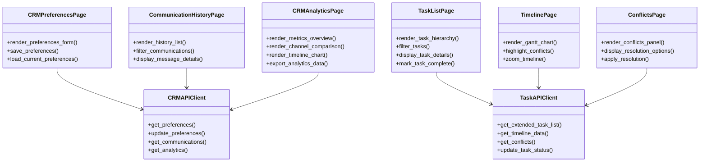

# Design Document - Streamlit GUI CRM & Task Management Integration

## Overview

This document provides the comprehensive design for integrating CRM Communication Engine and Task Management Agent features into the existing Streamlit GUI for Event Planning Agent v2. The integration adds new pages, components, and API integrations to provide users with comprehensive interfaces for managing communications, viewing task lists, visualizing timelines, and resolving conflicts.

### Design Goals

1. **Seamless Integration**: Extend existing Streamlit GUI without disrupting current functionality
2. **Intuitive User Experience**: Provide clear, easy-to-use interfaces for complex features
3. **Real-Time Updates**: Keep communication and task status current with polling and refresh mechanisms
4. **Mobile Responsiveness**: Ensure all new features work well on mobile devices
5. **Performance**: Optimize data loading and rendering for large task lists and communication histories
6. **Reusability**: Create modular components that can be reused across pages

### System Context

The integration extends the existing Streamlit GUI with:
- **New Pages**: CRM preferences, communication history, analytics, task list, timeline, conflicts
- **New Components**: Task cards, timeline charts, conflict panels, analytics widgets
- **API Integration**: CRM and Task Management API endpoints
- **State Management**: Extended session state for CRM and task data

## Architecture

### High-Level Architecture


### Component Architecture



## Components and Interfaces

### 1. CRM Preferences Page

**File**: `streamlit_gui/pages/crm_preferences.py`

**Purpose**: Allow users to manage communication preferences

**Interface**:
```python
def render_crm_preferences_page():
    """Main rendering function for CRM preferences page"""
    st.header("💬 Communication Preferences")
    
    # Load current preferences
    preferences = load_preferences()
    
    # Render preference form
    with st.form("preferences_form"):
        # Channel selection
        preferred_channels = st.multiselect(
            "Preferred Communication Channels",
            options=["Email", "SMS", "WhatsApp"],
            default=preferences.get("preferred_channels", ["Email"])
        )
        
        # Timezone selection
        timezone = st.selectbox(
            "Your Timezone",
            options=get_timezone_list(),
            index=get_timezone_index(preferences.get("timezone", "UTC"))
        )
        
        # Quiet hours
        col1, col2 = st.columns(2)
        with col1:
            quiet_start = st.time_input(
                "Quiet Hours Start",
                value=parse_time(preferences.get("quiet_hours_start", "22:00"))
            )
        with col2:
            quiet_end = st.time_input(
                "Quiet Hours End",
                value=parse_time(preferences.get("quiet_hours_end", "08:00"))
            )
        
        # Opt-out toggles
        st.subheader("Opt-Out Options")
        opt_out_email = st.checkbox("Opt out of Email", value=preferences.get("opt_out_email", False))
        opt_out_sms = st.checkbox("Opt out of SMS", value=preferences.get("opt_out_sms", False))
        opt_out_whatsapp = st.checkbox("Opt out of WhatsApp", value=preferences.get("opt_out_whatsapp", False))
        
        # Submit button
        submitted = st.form_submit_button("Save Preferences")
        
        if submitted:
            save_preferences({
                "preferred_channels": preferred_channels,
                "timezone": timezone,
                "quiet_hours_start": quiet_start.strftime("%H:%M"),
                "quiet_hours_end": quiet_end.strftime("%H:%M"),
                "opt_out_email": opt_out_email,
                "opt_out_sms": opt_out_sms,
                "opt_out_whatsapp": opt_out_whatsapp
            })
```

**Key Features**:
- Multi-select for preferred channels
- Timezone dropdown with search
- Time pickers for quiet hours
- Toggle switches for opt-outs
- Form validation and error handling
- Success/error messages

