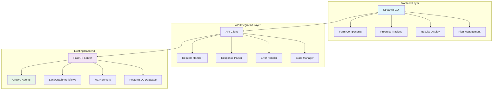

# Design Document

## Overview

The Streamlit GUI for Event Planning Agent v2 will provide a modern, intuitive web interface that connects to the existing FastAPI backend. The design follows a multi-page application structure with clear navigation, real-time progress tracking, and comprehensive result visualization. The interface will leverage Streamlit's native components while maintaining integration with the existing CrewAI agents, LangGraph workflows, and MCP servers.

## Architecture

### System Architecture



### Component Architecture

The application will be structured as a multi-page Streamlit application with the following components:

1. **Main Application (`app.py`)**
   - Entry point and navigation
   - Session state management
   - Configuration loading

2. **Pages Module (`pages/`)**
   - `home.py` - Landing page and plan overview
   - `create_plan.py` - Event planning form
   - `plan_status.py` - Progress tracking and monitoring
   - `plan_results.py` - Results display and combination selection
   - `plan_blueprint.py` - Final blueprint display and download

3. **Components Module (`components/`)**
   - `forms.py` - Reusable form components
   - `progress.py` - Progress tracking components
   - `results.py` - Result display components
   - `api_client.py` - API integration utilities

4. **Utils Module (`utils/`)**
   - `config.py` - Configuration management
   - `helpers.py` - Utility functions
   - `validators.py` - Input validation

## Components and Interfaces

### 1. Main Application Interface

**File**: `streamlit_gui/app.py`

The main application will use Streamlit's multi-page functionality:

```python
# Main navigation structure
pages = {
    "🏠 Home": "pages.home",
    "➕ Create Plan": "pages.create_plan", 
    "📊 Plan Status": "pages.plan_status",
    "🎯 Results": "pages.plan_results",
    "📋 Blueprint": "pages.plan_blueprint"
}
```

**Key Features**:
- Sidebar navigation with icons
- Session state management for plan data
- Configuration loading from environment
- Connection status indicator
- User authentication (if enabled)

### 2. Event Planning Form Interface

**File**: `streamlit_gui/pages/create_plan.py`

Multi-section form with progressive disclosure:

**Section 1: Basic Information**
- Client name (text input)
- Event type (selectbox)
- Event date (date picker)
- Location (text input with suggestions)

**Section 2: Guest Information**
- Total guests (number input)
- Ceremony vs Reception split (optional)
- Guest demographics (optional)

**Section 3: Budget & Preferences**
- Total budget (number input with currency formatting)
- Budget allocation preferences (sliders)
- Priority ranking (drag-and-drop or selectbox)

**Section 4: Venue Preferences**
- Venue types (multiselect)
- Essential amenities (multiselect)
- Location preferences (multiselect)
- Capacity requirements (number inputs)

**Section 5: Catering Preferences**
- Cuisine preferences (multiselect)
- Dietary restrictions (multiselect)
- Service style (selectbox)
- Beverage preferences (checkboxes)

**Section 6: Additional Services**
- Photography requirements (text area + checkboxes)
- Videography needs (checkboxes)
- Makeup requirements (text area + checkboxes)
- Entertainment preferences (text area)
- Transportation needs (text area)

**Section 7: Client Vision**
- Detailed description (text area)
- Theme preferences (text input)
- Color scheme (color picker or text)
- Style preferences (multiselect)

### 3. Progress Tracking Interface

**File**: `streamlit_gui/pages/plan_status.py`

Real-time workflow monitoring:

```python
# Progress display structure
progress_sections = {
    "initialization": "🚀 Initializing Planning Process",
    "budget_allocation": "💰 Analyzing Budget Requirements", 
    "vendor_sourcing": "🔍 Sourcing Vendors",
    "beam_search": "🎯 Optimizing Combinations",
    "client_selection": "👤 Awaiting Selection",
    "blueprint_generation": "📋 Generating Blueprint"
}
```

**Key Features**:
- Progress bar with percentage completion
- Current step indicator with icons
- Agent activity display (which agent is working)
- Estimated time remaining
- Log messages from workflow execution
- Error handling and retry options

### 4. Results Display Interface

**File**: `streamlit_gui/pages/plan_results.py`

Comprehensive results visualization:

**Layout Options**:
- Card view (default) - Each combination as a card
- Table view - Comparison table format
- Detailed view - Expandable sections per combination

**Combination Display**:
- Fitness score (prominent display)
- Total cost (formatted currency)
- Vendor summary (name, type, key features)
- Quick comparison metrics
- Selection button

**Vendor Details**:
- Contact information
- Pricing breakdown
- Amenities and features
- Location and logistics
- Customer ratings (if available)

**Comparison Tools**:
- Side-by-side comparison
- Sorting options (cost, score, location)
- Filtering capabilities
- Export options

### 5. Blueprint Display Interface

**File**: `streamlit_gui/pages/plan_blueprint.py`

Final plan presentation:

**Blueprint Sections**:
- Executive summary
- Event timeline
- Vendor contact sheet
- Logistics plan
- Budget breakdown
- Next steps checklist

**Download Options**:
- PDF generation
- JSON export
- Formatted text
- Email sharing (if configured)

## Data Models

### Session State Schema

```python
class SessionState:
    # Current plan data
    current_plan_id: Optional[str] = None
    plan_data: Optional[Dict] = None
    
    # Form state
    form_data: Dict = {}
    form_step: int = 1
    form_completed: bool = False
    
    # API state
    api_connected: bool = False
    last_api_check: Optional[datetime] = None
    
    # Progress tracking
    workflow_status: Optional[str] = None
    progress_percentage: float = 0.0
    current_step: Optional[str] = None
    
    # Results
    combinations: List[Dict] = []
    selected_combination: Optional[Dict] = None
    blueprint: Optional[Dict] = None
```

### API Integration Schema

```python
class APIClient:
    base_url: str
    timeout: int = 30
    retry_attempts: int = 3
    
    async def create_plan(self, request_data: Dict) -> Dict
    async def get_plan_status(self, plan_id: str) -> Dict
    async def select_combination(self, plan_id: str, combination_id: str) -> Dict
    async def get_blueprint(self, plan_id: str) -> Dict
    async def health_check() -> Dict
```

## Error Handling

### Error Categories

1. **Connection Errors**
   - API server unavailable
   - Network timeouts
   - Authentication failures

2. **Validation Errors**
   - Invalid form inputs
   - Missing required fields
   - Data format errors

3. **Processing Errors**
   - Workflow execution failures
   - Agent errors
   - Database issues

4. **User Errors**
   - Invalid selections
   - Conflicting requirements
   - Budget constraints

### Error Display Strategy

- **Toast notifications** for minor errors
- **Alert boxes** for important warnings
- **Error pages** for critical failures
- **Inline validation** for form errors
- **Retry mechanisms** for transient failures

## Testing Strategy

### Unit Testing

- Form validation functions
- API client methods
- Data transformation utilities
- Error handling logic

### Integration Testing

- API connectivity tests
- End-to-end workflow tests
- Session state management tests
- Multi-page navigation tests

### User Acceptance Testing

- Form usability testing
- Progress tracking accuracy
- Results display clarity
- Blueprint generation quality

### Performance Testing

- Large form handling
- Real-time updates
- Concurrent user sessions
- API response times

## Security Considerations

### Data Protection

- Session state encryption
- Secure API communication (HTTPS)
- Input sanitization
- XSS prevention

### Authentication Integration

- Support for existing auth mechanisms
- Session timeout handling
- Role-based access (if needed)
- Audit logging

### Configuration Security

- Environment variable usage
- Secrets management
- API key protection
- Database connection security

## Deployment Architecture

### Development Environment

```yaml
# docker-compose.gui.yml
version: '3.8'
services:
  streamlit-gui:
    build: ./streamlit_gui
    ports:
      - "8501:8501"
    environment:
      - API_BASE_URL=http://api:8000
      - ENVIRONMENT=development
    depends_on:
      - api
    volumes:
      - ./streamlit_gui:/app
```

### Production Deployment

- **Container**: Docker container with Streamlit server
- **Reverse Proxy**: Nginx for SSL termination and routing
- **Load Balancing**: Multiple Streamlit instances if needed
- **Monitoring**: Health checks and performance metrics
- **Logging**: Structured logging with correlation IDs

## Performance Optimizations

### Caching Strategy

- **API Response Caching**: Cache vendor data and static content
- **Session State Optimization**: Minimize state size and updates
- **Component Caching**: Cache expensive computations
- **Image Optimization**: Optimize logos and graphics

### Loading Optimizations

- **Lazy Loading**: Load components as needed
- **Progressive Enhancement**: Show basic content first
- **Async Operations**: Non-blocking API calls
- **Preloading**: Anticipate user actions

### User Experience Enhancements

- **Auto-save**: Preserve form data automatically
- **Offline Support**: Basic functionality without API
- **Mobile Optimization**: Responsive design
- **Accessibility**: WCAG compliance
- **Internationalization**: Multi-language support (future)

## Configuration Management

### Environment Variables

```bash
# API Configuration
API_BASE_URL=http://localhost:8000
API_TIMEOUT=30
API_RETRY_ATTEMPTS=3

# UI Configuration  
APP_TITLE="Event Planning Agent"
APP_ICON="🎉"
THEME_PRIMARY_COLOR="#1f77b4"

# Feature Flags
ENABLE_AUTH=false
ENABLE_ANALYTICS=false
ENABLE_OFFLINE_MODE=false

# Performance
CACHE_TTL=300
MAX_UPLOAD_SIZE=10MB
SESSION_TIMEOUT=3600
```

### Configuration Loading

- Environment-specific configs
- Runtime configuration updates
- Feature flag management
- A/B testing support (future)

This design provides a comprehensive, user-friendly interface that leverages all existing Event Planning Agent v2 functionality while providing an intuitive web-based experience for event planners.