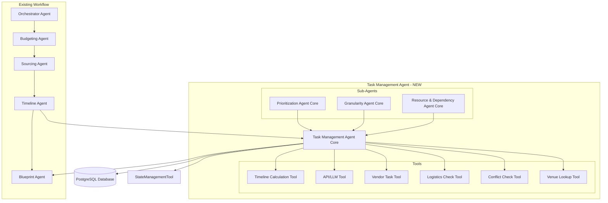

# Task Management Agent Design Document

## Overview

The Task Management Agent is a new orchestration component that extends the existing event_planning_agent_v2 system. It sits between the client selection phase and the blueprint generation phase in the LangGraph workflow, processing selected vendor combinations to generate a comprehensive, extended task list with timeline calculations, vendor assignments, logistics verification, and conflict resolution.

### System Context

The Task Management Agent integrates with:
- **Existing LangGraph Workflow**: Adds a new node in planning_workflow.py between client selection and blueprint generation
- **Existing State Management**: Uses EventPlanningState TypedDict and StateManagementTool from orchestrator.py
- **Existing Database Infrastructure**: Leverages PostgreSQL connection from database/connection.py and models from database/models.py
- **Existing LLM Infrastructure**: Uses Ollama (gemma:2b or tinyllama) through CrewAI Agent framework
- **Existing Timeline Agent**: Integrates with ConflictDetectionTool and TimelineGenerationTool from timeline_tools.py
- **Existing Sourcing Agent**: Uses vendor data from beam search results and selected_combination
- **Existing Blueprint Agent**: Provides extended_task_list output for final blueprint generation
- **Existing Error Handling**: Uses error_handling module patterns for resilience

### Key Design Principles

1. **Non-Disruptive Integration**: Extend existing workflow without modifying core agent logic
2. **Reuse Existing Infrastructure**: Leverage existing tools, state management, and database connections
3. **Modular Tool Design**: Create independent, composable tools that can be invoked in sequence
4. **Graceful Degradation**: Continue processing even if individual tools fail
5. **State-Driven Processing**: Use EventPlanningState as the single source of truth

## Architecture

### High-Level Architecture



### Workflow Integration

The Task Management Agent is inserted as a new node in the existing LangGraph workflow:

```python
# In planning_workflow.py (conceptual)
workflow.add_node("task_management", task_management_node)
workflow.add_edge("timeline_generation", "task_management")
workflow.add_edge("task_management", "blueprint_generation")
```

### Processing Flow

1. **Input**: Receives EventPlanningState with selected_combination, timeline_data, and vendor data
2. **Sub-Agent Consolidation**: Collects data from three specialized sub-agents
3. **Tool Processing**: Sequentially processes consolidated data through six tools
4. **Output**: Updates EventPlanningState with extended_task_list field
5. **Handoff**: Passes control to Blueprint Agent

## Components and Interfaces

### 1. Task Management Agent Core

**Purpose**: Main orchestrator that coordinates sub-agents and tools

**Interface**:
```python
class TaskManagementAgent:
    def __init__(self, state_manager: StateManager, llm: BaseChatModel):
        """Initialize with existing state manager and LLM"""
        
    def process(self, state: EventPlanningState) -> EventPlanningState:
        """Main processing method that orchestrates all sub-agents and tools"""
        
    def _consolidate_sub_agent_data(self, state: EventPlanningState) -> ConsolidatedTaskData:
        """Collect and merge data from three sub-agents"""
        
    def _process_tools(self, consolidated_data: ConsolidatedTaskData, state: EventPlanningState) -> ExtendedTaskList:
        """Process data through all tools sequentially"""
        
    def _generate_extended_task_list(self, tool_results: Dict, state: EventPlanningState) -> ExtendedTaskList:
        """Generate final extended task list from all tool outputs"""
```

**Dependencies**:
- StateManagementTool from orchestrator.py
- EventPlanningState from state_models.py
- Ollama LLM through CrewAI
- Database connection from database/connection.py

### 2. Prioritization Agent Core (Sub-Agent)

**Purpose**: Analyzes tasks and assigns priority levels based on event requirements

**Interface**:
```python
class PrioritizationAgentCore:
    def __init__(self, llm: BaseChatModel):
        """Initialize with LLM for intelligent prioritization"""
        
    def prioritize_tasks(self, state: EventPlanningState) -> List[PrioritizedTask]:
        """Analyze tasks and assign priority levels (Critical, High, Medium, Low)"""
        
    def _calculate_priority_score(self, task: Dict, event_context: Dict) -> float:
        """Calculate numerical priority score based on multiple factors"""
```

**Output Data Structure**:
```python
@dataclass
class PrioritizedTask:
    task_id: str
    task_name: str
    priority_level: str  # Critical, High, Medium, Low
    priority_score: float
    priority_rationale: str
```

### 3. Granularity Agent Core (Sub-Agent)

**Purpose**: Breaks down high-level tasks into detailed, actionable sub-tasks

**Interface**:
```python
class GranularityAgentCore:
    def __init__(self, llm: BaseChatModel):
        """Initialize with LLM for task decomposition"""
        
    def decompose_tasks(self, tasks: List[PrioritizedTask], state: EventPlanningState) -> List[GranularTask]:
        """Break down tasks into granular sub-tasks"""
        
    def _determine_granularity_level(self, task: PrioritizedTask) -> int:
        """Determine appropriate level of task breakdown"""
```

**Output Data Structure**:
```python
@dataclass
class GranularTask:
    task_id: str
    parent_task_id: Optional[str]
    task_name: str
    task_description: str
    granularity_level: int  # 0=top-level, 1=sub-task, 2=detailed sub-task
    estimated_duration: timedelta
    sub_tasks: List[str]  # IDs of child tasks
```

### 4. Resource & Dependency Agent Core (Sub-Agent)

**Purpose**: Identifies resource requirements and task dependencies

**Interface**:
```python
class ResourceDependencyAgentCore:
    def __init__(self, llm: BaseChatModel):
        """Initialize with LLM for dependency analysis"""
        
    def analyze_dependencies(self, tasks: List[GranularTask], state: EventPlanningState) -> List[TaskWithDependencies]:
        """Identify dependencies and resource requirements"""
        
    def _detect_dependencies(self, task: GranularTask, all_tasks: List[GranularTask]) -> List[str]:
        """Detect which tasks must complete before this task"""
        
    def _identify_resources(self, task: GranularTask, state: EventPlanningState) -> List[Resource]:
        """Identify required resources (vendors, equipment, personnel)"""
```

**Output Data Structure**:
```python
@dataclass
class TaskWithDependencies:
    task_id: str
    task_name: str
    dependencies: List[str]  # IDs of prerequisite tasks
    resources_required: List[Resource]
    resource_conflicts: List[str]  # Potential resource conflicts
    
@dataclass
class Resource:
    resource_type: str  # vendor, equipment, personnel, venue
    resource_id: str
    resource_name: str
    quantity_required: int
    availability_constraint: Optional[str]
```

### 5. Consolidated Task Data Structure

**Purpose**: Unified data structure combining outputs from all three sub-agents

```python
@dataclass
class ConsolidatedTaskData:
    tasks: List[ConsolidatedTask]
    event_context: Dict
    processing_metadata: Dict
    
@dataclass
class ConsolidatedTask:
    # From Prioritization Agent
    task_id: str
    task_name: str
    priority_level: str
    priority_score: float
    priority_rationale: str
    
    # From Granularity Agent
    parent_task_id: Optional[str]
    task_description: str
    granularity_level: int
    estimated_duration: timedelta
    sub_tasks: List[str]
    
    # From Resource & Dependency Agent
    dependencies: List[str]
    resources_required: List[Resource]
    resource_conflicts: List[str]
    
    # To be populated by tools
    timeline: Optional[TaskTimeline] = None
    llm_enhancements: Optional[Dict] = None
    assigned_vendors: List[str] = field(default_factory=list)
    logistics_status: Optional[LogisticsStatus] = None
    conflicts: List[Conflict] = field(default_factory=list)
    venue_info: Optional[VenueInfo] = None
```

### 6. Timeline Calculation Tool

**Purpose**: Calculate start and end times for tasks based on dependencies and priorities

**Interface**:
```python
class TimelineCalculationTool:
    def __init__(self, timeline_agent_tools: Dict):
        """Initialize with references to existing Timeline Agent tools"""
        
    def calculate_timelines(self, consolidated_data: ConsolidatedTaskData, state: EventPlanningState) -> List[TaskTimeline]:
        """Calculate start/end times for all tasks"""
        
    def _topological_sort(self, tasks: List[ConsolidatedTask]) -> List[ConsolidatedTask]:
        """Sort tasks by dependencies using topological sort"""
        
    def _schedule_task(self, task: ConsolidatedTask, scheduled_tasks: Dict) -> TaskTimeline:
        """Schedule individual task based on dependencies and constraints"""
```

**Integration Points**:
- Uses existing TimelineGenerationTool from timeline_tools.py
- Leverages existing ConflictDetectionTool for validation
- Reads timeline_data from EventPlanningState

**Output Data Structure**:
```python
@dataclass
class TaskTimeline:
    task_id: str
    start_time: datetime
    end_time: datetime
    duration: timedelta
    buffer_time: timedelta
    scheduling_constraints: List[str]
```

### 7. API/LLM Tool (Consolidated Task Data Tool)

**Purpose**: Enhance task descriptions and provide intelligent suggestions using LLM

**Interface**:
```python
class APILLMTool:
    def __init__(self, llm: BaseChatModel):
        """Initialize with existing Ollama LLM"""
        
    def enhance_tasks(self, consolidated_data: ConsolidatedTaskData, state: EventPlanningState) -> List[EnhancedTask]:
        """Use LLM to enhance task descriptions and provide suggestions"""
        
    def _generate_enhancement_prompt(self, task: ConsolidatedTask, context: Dict) -> str:
        """Create prompt for LLM enhancement"""
        
    def _parse_llm_response(self, response: str) -> Dict:
        """Parse LLM response into structured enhancement data"""
```

**Integration Points**:
- Uses existing Ollama infrastructure (gemma:2b or tinyllama)
- Leverages CrewAI Agent framework
- Implements retry logic with existing error handling patterns

**Output Data Structure**:
```python
@dataclass
class EnhancedTask:
    task_id: str
    enhanced_description: str
    suggestions: List[str]
    potential_issues: List[str]
    best_practices: List[str]
    requires_manual_review: bool
```

### 8. Vendor Task Tool

**Purpose**: Assign vendors from selected combination to appropriate tasks

**Interface**:
```python
class VendorTaskTool:
    def __init__(self, db_connection):
        """Initialize with database connection"""
        
    def assign_vendors(self, consolidated_data: ConsolidatedTaskData, state: EventPlanningState) -> List[VendorAssignment]:
        """Assign vendors to tasks based on selected combination"""
        
    def _match_vendor_to_task(self, task: ConsolidatedTask, vendors: List[Dict]) -> Optional[str]:
        """Match best vendor to task based on capabilities and fitness score"""
        
    def _get_vendor_from_combination(self, vendor_id: str, state: EventPlanningState) -> Dict:
        """Retrieve vendor details from selected_combination"""
```

**Integration Points**:
- Uses selected_combination from EventPlanningState
- Leverages vendor data from Sourcing Agent's beam search results
- Accesses database/models.py for vendor details
- Uses MCP vendor server if available for enhanced information

**Output Data Structure**:
```python
@dataclass
class VendorAssignment:
    task_id: str
    vendor_id: str
    vendor_name: str
    vendor_type: str
    fitness_score: float
    assignment_rationale: str
    requires_manual_assignment: bool
```

### 9. Logistics Check Tool

**Purpose**: Verify logistics feasibility for tasks

**Interface**:
```python
class LogisticsCheckTool:
    def __init__(self, db_connection):
        """Initialize with database connection"""
        
    def verify_logistics(self, consolidated_data: ConsolidatedTaskData, state: EventPlanningState) -> List[LogisticsStatus]:
        """Verify logistics for all tasks"""
        
    def _check_transportation(self, task: ConsolidatedTask, venue: Dict) -> Dict:
        """Verify transportation requirements and availability"""
        
    def _check_equipment(self, task: ConsolidatedTask, resources: List[Resource]) -> Dict:
        """Verify equipment availability"""
        
    def _check_setup_requirements(self, task: ConsolidatedTask, venue: Dict) -> Dict:
        """Verify setup time and space requirements"""
```

**Output Data Structure**:
```python
@dataclass
class LogisticsStatus:
    task_id: str
    transportation_status: str  # verified, issue, missing_data
    transportation_notes: str
    equipment_status: str
    equipment_notes: str
    setup_status: str
    setup_notes: str
    overall_feasibility: str  # feasible, needs_attention, not_feasible
    issues: List[str]
```

### 10. Conflict Check Tool

**Purpose**: Detect and report scheduling and resource conflicts

**Interface**:
```python
class ConflictCheckTool:
    def __init__(self, timeline_conflict_tool):
        """Initialize with reference to existing ConflictDetectionTool"""
        
    def check_conflicts(self, consolidated_data: ConsolidatedTaskData, state: EventPlanningState) -> List[Conflict]:
        """Check for all types of conflicts"""
        
    def _check_timeline_conflicts(self, tasks: List[ConsolidatedTask]) -> List[Conflict]:
        """Use existing Timeline Agent conflict detection"""
        
    def _check_resource_conflicts(self, tasks: List[ConsolidatedTask]) -> List[Conflict]:
        """Detect resource double-booking"""
        
    def _check_venue_conflicts(self, tasks: List[ConsolidatedTask], state: EventPlanningState) -> List[Conflict]:
        """Detect venue availability conflicts"""
```

**Integration Points**:
- Uses existing ConflictDetectionTool from timeline_tools.py
- Reads timeline_data from EventPlanningState
- Leverages existing conflict detection algorithms

**Output Data Structure**:
```python
@dataclass
class Conflict:
    conflict_id: str
    conflict_type: str  # timeline, resource, venue
    severity: str  # critical, high, medium, low
    affected_tasks: List[str]
    conflict_description: str
    suggested_resolutions: List[str]
```

### 11. Venue Lookup Tool

**Purpose**: Retrieve and attach venue information to tasks

**Interface**:
```python
class VenueLookupTool:
    def __init__(self, db_connection):
        """Initialize with database connection"""
        
    def lookup_venues(self, consolidated_data: ConsolidatedTaskData, state: EventPlanningState) -> List[VenueInfo]:
        """Lookup venue information for tasks"""
        
    def _get_venue_from_combination(self, state: EventPlanningState) -> Optional[Dict]:
        """Retrieve venue from selected_combination"""
        
    def _get_venue_details(self, venue_id: str) -> Dict:
        """Query database for detailed venue information"""
```

**Integration Points**:
- Uses selected_combination from EventPlanningState
- Queries database using database/connection.py
- Uses existing venue data structure from database/models.py
- Leverages MCP vendor server if available

**Output Data Structure**:
```python
@dataclass
class VenueInfo:
    task_id: str
    venue_id: str
    venue_name: str
    venue_type: str
    capacity: int
    available_equipment: List[str]
    setup_time_required: timedelta
    teardown_time_required: timedelta
    access_restrictions: List[str]
    requires_venue_selection: bool
```

### 12. Extended Task List

**Purpose**: Final output structure containing all processed task data

```python
@dataclass
class ExtendedTaskList:
    tasks: List[ExtendedTask]
    processing_summary: ProcessingSummary
    metadata: Dict
    
@dataclass
class ExtendedTask:
    # Original consolidated data
    task_id: str
    task_name: str
    task_description: str
    priority_level: str
    priority_score: float
    granularity_level: int
    parent_task_id: Optional[str]
    sub_tasks: List[str]
    dependencies: List[str]
    resources_required: List[Resource]
    
    # Tool enhancements
    timeline: TaskTimeline
    llm_enhancements: Dict
    assigned_vendors: List[VendorAssignment]
    logistics_status: LogisticsStatus
    conflicts: List[Conflict]
    venue_info: Optional[VenueInfo]
    
    # Status flags
    has_errors: bool
    has_warnings: bool
    requires_manual_review: bool
    error_messages: List[str]
    warning_messages: List[str]
    
@dataclass
class ProcessingSummary:
    total_tasks: int
    tasks_with_errors: int
    tasks_with_warnings: int
    tasks_requiring_review: int
    processing_time: float
    tool_execution_status: Dict[str, str]
```

## Data Models

### State Extension

The Task Management Agent extends EventPlanningState with a new field:

```python
# In state_models.py (extension)
class EventPlanningState(TypedDict):
    # ... existing fields ...
    extended_task_list: Optional[ExtendedTaskList]  # NEW FIELD
```

### Database Schema Extensions

New tables to persist task management data:

```sql
-- Task Management table
CREATE TABLE task_management_runs (
    id SERIAL PRIMARY KEY,
    event_id INTEGER REFERENCES events(id),
    run_timestamp TIMESTAMP DEFAULT CURRENT_TIMESTAMP,
    processing_summary JSONB,
    status VARCHAR(50),
    error_log TEXT
);

-- Extended Tasks table
CREATE TABLE extended_tasks (
    id SERIAL PRIMARY KEY,
    task_management_run_id INTEGER REFERENCES task_management_runs(id),
    task_id VARCHAR(100) UNIQUE,
    task_data JSONB,  -- Stores full ExtendedTask structure
    created_at TIMESTAMP DEFAULT CURRENT_TIMESTAMP,
    updated_at TIMESTAMP DEFAULT CURRENT_TIMESTAMP
);

-- Task Conflicts table
CREATE TABLE task_conflicts (
    id SERIAL PRIMARY KEY,
    task_management_run_id INTEGER REFERENCES task_management_runs(id),
    conflict_id VARCHAR(100),
    conflict_data JSONB,
    resolution_status VARCHAR(50),
    resolved_at TIMESTAMP
);
```

## Error Handling

### Error Handling Strategy

The Task Management Agent follows existing error handling patterns from the error_handling module:

1. **Tool-Level Errors**: Each tool implements try-catch with graceful degradation
2. **Sub-Agent Errors**: Missing sub-agent data is logged but doesn't block processing
3. **Database Errors**: Uses existing recovery patterns from error_handling/recovery.py
4. **LLM Errors**: Implements retry logic with fallback to unenhanced data
5. **State Errors**: Uses StateTransitionLogger for error tracking

### Error Categories

```python
class TaskManagementError(Exception):
    """Base exception for Task Management Agent"""
    
class SubAgentDataError(TaskManagementError):
    """Raised when sub-agent data is missing or invalid"""
    
class ToolExecutionError(TaskManagementError):
    """Raised when a tool fails to execute"""
    
class ConsolidationError(TaskManagementError):
    """Raised when data consolidation fails"""
```

### Error Recovery

```python
def process_with_error_handling(self, state: EventPlanningState) -> EventPlanningState:
    try:
        # Main processing logic
        return self.process(state)
    except SubAgentDataError as e:
        # Log error, continue with partial data
        logger.error(f"Sub-agent data error: {e}")
        state['error_count'] = state.get('error_count', 0) + 1
        state['last_error'] = str(e)
        return self._process_with_partial_data(state)
    except ToolExecutionError as e:
        # Log error, mark affected tasks
        logger.error(f"Tool execution error: {e}")
        return self._mark_tasks_with_errors(state, e)
    except Exception as e:
        # Critical error, use existing error handling
        logger.critical(f"Critical error in Task Management Agent: {e}")
        state['workflow_status'] = WorkflowStatus.FAILED
        state['last_error'] = str(e)
        return state
```

## Testing Strategy

### Unit Testing

1. **Sub-Agent Tests**:
   - Test prioritization logic with various task types
   - Test granularity decomposition with different complexity levels
   - Test dependency detection algorithms
   - Test resource identification logic

2. **Tool Tests**:
   - Test timeline calculation with various dependency graphs
   - Test LLM enhancement with mock LLM responses
   - Test vendor assignment with different vendor combinations
   - Test logistics verification with various scenarios
   - Test conflict detection with overlapping tasks
   - Test venue lookup with database mocks

3. **Integration Tests**:
   - Test data consolidation from all three sub-agents
   - Test sequential tool processing
   - Test extended task list generation
   - Test state management integration
   - Test database persistence

### Integration Testing

1. **Workflow Integration**:
   - Test Task Management Agent node in full LangGraph workflow
   - Test state transitions between Timeline Agent and Task Management Agent
   - Test state transitions between Task Management Agent and Blueprint Agent
   - Test error propagation through workflow

2. **Database Integration**:
   - Test persistence of extended task list
   - Test retrieval of vendor and venue data
   - Test transaction handling and rollback

3. **LLM Integration**:
   - Test Ollama integration with actual models
   - Test CrewAI agent framework integration
   - Test timeout and retry logic

### End-to-End Testing

1. **Full Workflow Test**:
   - Run complete event planning workflow with Task Management Agent
   - Verify extended task list is generated correctly
   - Verify Blueprint Agent receives and uses extended task list
   - Verify all data is persisted to database

2. **Error Scenario Tests**:
   - Test with missing sub-agent data
   - Test with database unavailability
   - Test with LLM failures
   - Test with conflicting task requirements

3. **Performance Tests**:
   - Test with large numbers of tasks (100+, 500+, 1000+)
   - Test with complex dependency graphs
   - Test with multiple vendor combinations
   - Measure processing time and resource usage

### Test Data

Create test fixtures for:
- Sample EventPlanningState with realistic data
- Sample vendor combinations from Sourcing Agent
- Sample timeline data from Timeline Agent
- Sample task lists with various complexity levels
- Sample conflict scenarios
- Sample venue and vendor data

### Mocking Strategy

Mock external dependencies:
- Database connections (use in-memory SQLite for tests)
- LLM calls (use predefined responses)
- Existing agent tools (use mock implementations)
- State manager (use test state manager)

## Implementation Notes

### Phase 1: Core Infrastructure
1. Create TaskManagementAgent class with basic structure
2. Implement ConsolidatedTaskData and ExtendedTaskList data structures
3. Set up database schema extensions
4. Integrate with existing workflow as new node

### Phase 2: Sub-Agents
1. Implement PrioritizationAgentCore
2. Implement GranularityAgentCore
3. Implement ResourceDependencyAgentCore
4. Implement data consolidation logic

### Phase 3: Tools
1. Implement TimelineCalculationTool
2. Implement APILLMTool
3. Implement VendorTaskTool
4. Implement LogisticsCheckTool
5. Implement ConflictCheckTool
6. Implement VenueLookupTool

### Phase 4: Integration
1. Wire all tools together in TaskManagementAgent
2. Implement error handling and recovery
3. Implement state management integration
4. Implement database persistence

### Phase 5: Testing & Refinement
1. Write and run unit tests
2. Write and run integration tests
3. Perform end-to-end testing
4. Optimize performance
5. Refine error handling

### Dependencies on Existing Code

- `state_models.py`: EventPlanningState TypedDict
- `orchestrator.py`: StateManagementTool
- `timeline_tools.py`: ConflictDetectionTool, TimelineGenerationTool
- `database/connection.py`: Database connection infrastructure
- `database/models.py`: Vendor and venue data models
- `database/state_manager.py`: State persistence
- `error_handling/`: All error handling modules
- `planning_workflow.py`: LangGraph workflow definition

### Configuration

Add configuration for Task Management Agent:

```python
# In config.py or similar
TASK_MANAGEMENT_CONFIG = {
    'enable_llm_enhancement': True,
    'llm_model': 'gemma:2b',  # or 'tinyllama'
    'max_retries': 3,
    'timeout_seconds': 30,
    'enable_conflict_detection': True,
    'enable_logistics_check': True,
    'enable_venue_lookup': True,
    'parallel_tool_execution': False,  # Sequential by default
    'log_level': 'INFO'
}
```