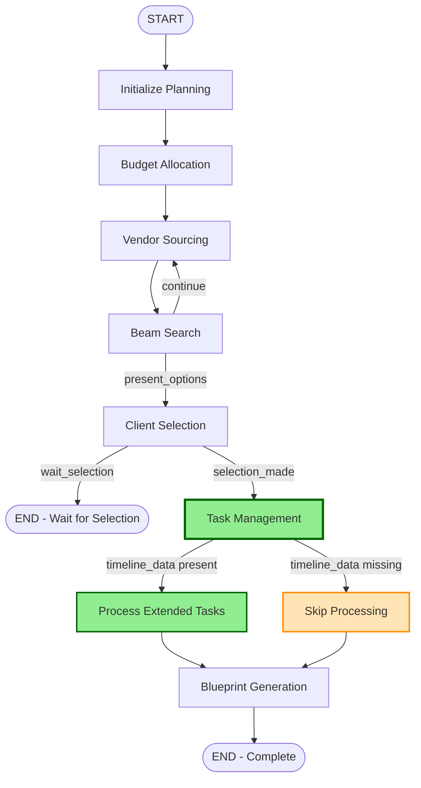
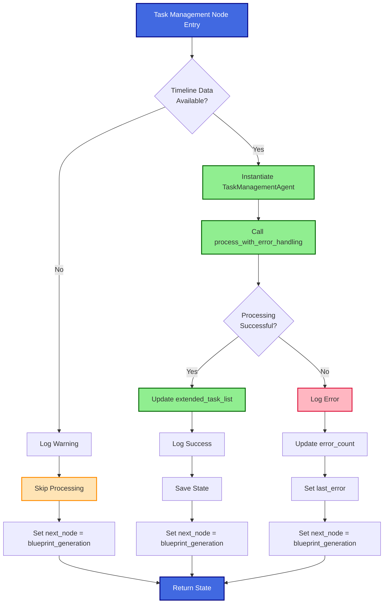
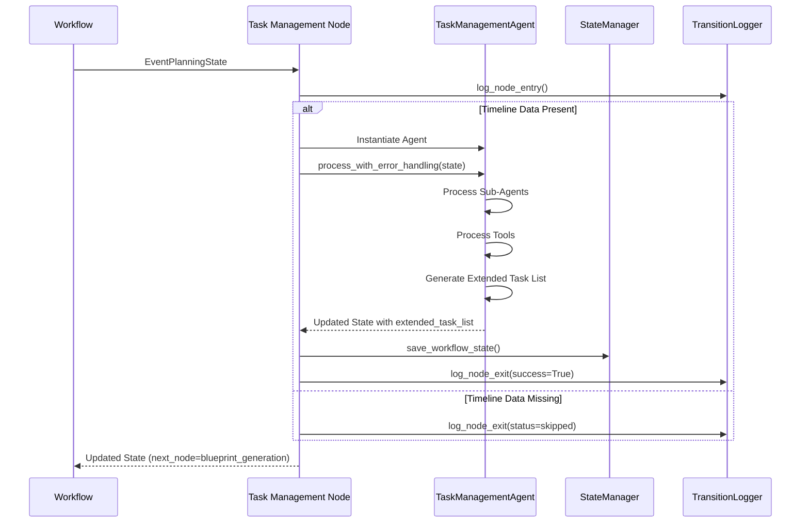
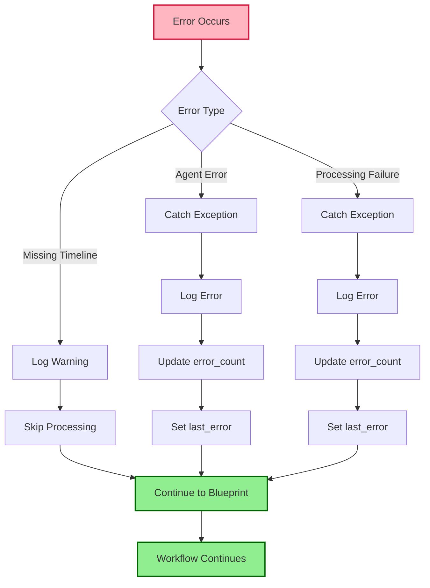

# Event Planning Workflow with Task Management Integration

## Complete Workflow Diagram



## Task Management Node Detail



## State Flow Through Task Management



## Integration Points

### Input Dependencies
- **timeline_data**: Required for task management processing
- **selected_combination**: Vendor combination selected by client
- **client_request**: Original client requirements
- **workflow_status**: Current workflow state

### Output Products
- **extended_task_list**: Comprehensive task data structure
  - tasks: List of ExtendedTask objects
  - processing_summary: Processing metrics
  - metadata: Additional context

### Downstream Consumers
- **Blueprint Generation Node**: Uses extended_task_list for comprehensive planning

## Error Handling Flow



## Conditional Execution Logic

```python
def should_run_task_management(state: EventPlanningState) -> bool:
    """
    Conditions for running task management:
    1. timeline_data must be present
    2. workflow_status must not be FAILED
    """
    has_timeline = state.get('timeline_data') is not None
    is_failed = state.get('workflow_status') == WorkflowStatus.FAILED.value
    
    return has_timeline and not is_failed
```

## Key Features

### 1. Graceful Degradation
- Workflow continues even if task management fails
- Blueprint generation can work without extended_task_list
- Errors are logged but don't block progress

### 2. Conditional Execution
- Automatically skips if timeline data is missing
- Checks workflow status before processing
- Logs reasons for skipping

### 3. State Management
- Uses existing StateManager for persistence
- Follows existing state transition patterns
- Comprehensive logging of all transitions

### 4. Error Tracking
- Increments error_count on failures
- Stores error messages in last_error
- Logs detailed error information

### 5. Async Support
- Properly handles async agent processing
- Uses asyncio.run() for async method calls
- Maintains workflow synchronous interface

## Performance Considerations

### Processing Time
- Task management adds processing time to workflow
- Typical processing: 1-5 seconds depending on task complexity
- Async processing prevents blocking

### Memory Usage
- Extended task list stored in state
- State manager handles persistence
- Memory-efficient data structures

### Scalability
- Handles large task lists efficiently
- Parallel processing in sub-agents
- Tool execution optimized

## Monitoring and Observability

### Logging Points
1. Node entry with input data
2. Timeline data validation
3. Agent instantiation
4. Processing start/completion
5. Error occurrences
6. Node exit with output data

### Metrics Available
- Processing time (in processing_summary)
- Total tasks processed
- Tasks with errors
- Tasks with warnings
- Success/failure status

### State Transitions
All transitions logged with:
- Node name
- Input data
- Output data
- Success status
- Timestamp
